# Building my DevOps Portfolio 🚀

## Project 6: Continuous Integration on AWS Cloud.

One of the benefits of working at EY is Udemy for Business. I enrolled in the DevOps Projects | 20 Real-Time DevOps Projects course to enhance my DevOps portfolio and I’m sharing this process for educational purposes.
Thanks Rox for giving me the free credits to keep using AWS to develop this project! Thanks for your support to the DevOps Community worldwide. 

### Scenario
- ✅ Agile Software Development Life Cycle.
- ✅ Developers make regular code changes.
- ✅ These commits need to be Build & Tested.
- ✅ Usually Build & Release Team will do this job or developers with responsibility to merge and integrate code

### Problem
- ❌In an Agile SDLC, there will be frequent code change.
- ❌Not so frequently code will be tested.
- ❌ Developers need to rework to fix bugs and errors.
- ❌ Manual Build and release process.
- ❌ Inter team dependencies.
- ❌CI server maintenance
- ❌Operational overhead to maintain server like Jenkins, Nexus, Sonar, Git, etc

###  Solution: Continuous Integration
- ♾️ Build and test for every commit.
- ♾️ Automated process.
- ♾️ Notify for every build status.
- ♾️ Fix code if bugs or error found instantly rather rather than waiting.
- ♾️ Cloud services for CI to remove Operations overhead.

###  Benefits CI Pipeline 
- ✅ Short Mean time to recovery (MTTR).
- ✅ Agile.
- ✅ No human intervention.
- ✅ Fault isolation.

###  Tools
- 🟠 Code commit (VCS)
- 🟠 Code artifact (Maven repo for dependencies)
- 🟠 Code build (Build service from AWS)
- 🟠 Sonarcloud (sonarqube cloud based tool)
- 🟠 Code pipeline 

### Steps

- ⏭️Login to AWS Account.
- ⏭️Code commit
- ⏭️Create codercommit repo
- ⏭️Create IAM user with codecommit policy
- ⏭️Generate SSH Key locally
- ⏭️Exchange keys with IAM user
- ⏭️Put source code from github repo to cc repository and push
- ⏭️Code artifact
- 	⏭️Create an IAM user with code artifact access
- ⏭️Install AWS CLI, configure
- ⏭️Export auth token
- ⏭️Exchange keys with IAM user
- ⏭️Update settings.xml file in source code top level directory.

- ⏭️SonarCloud
- 	⏭️Create sonar cloud account
- ⏭️Generate token
- ⏭️Create SSM parameters with sonar details
- ⏭️Create build project
- ⏭️Update codebuild role to access SSM parameter store

- ⏭️ Create notifications for sns or slack

- ⏭️Build project
- 	⏭️Update pom.xml with artifact version 
- ⏭️Create variables in SSM => parameterstore
- ⏭️Create build project
- ⏭️Update codebuild role to access SSMparamaterstore

- ⏭️Create pipeline
- 	⏭️Codecommit
- ⏭️Testcode
- ⏭️Build
- ⏭️Deploy to S3 bucket

- ⏭️Test pipeline

## Continuous integration steps
- AWS Diagram
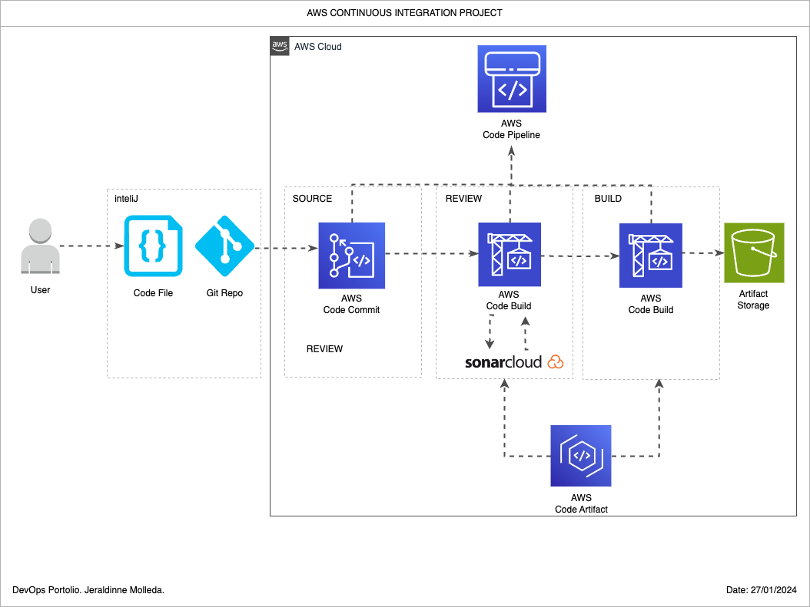
- Source Repository

- Parameters
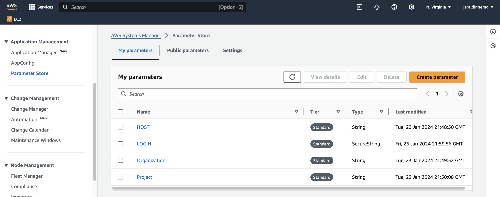
- Build
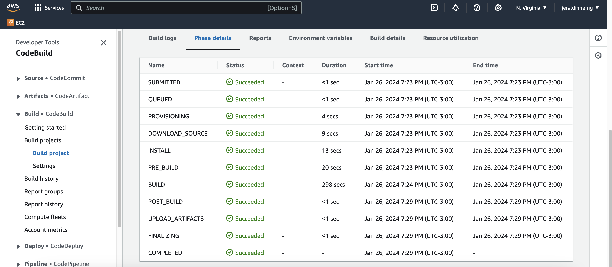
- Success Pipeline

- Pipeline source
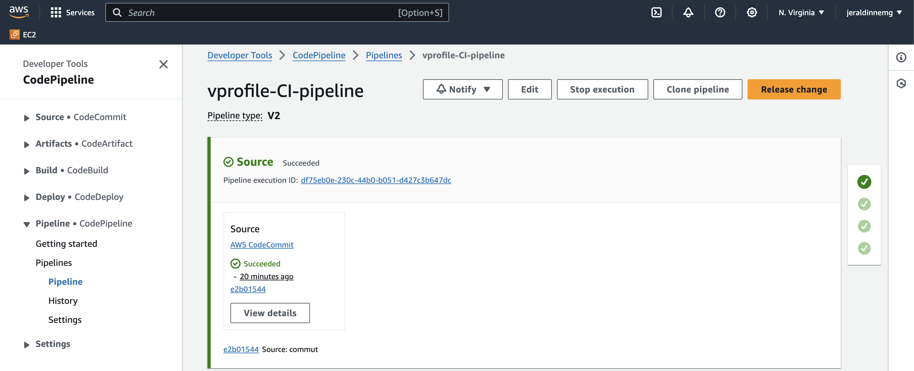
- Pipeline build
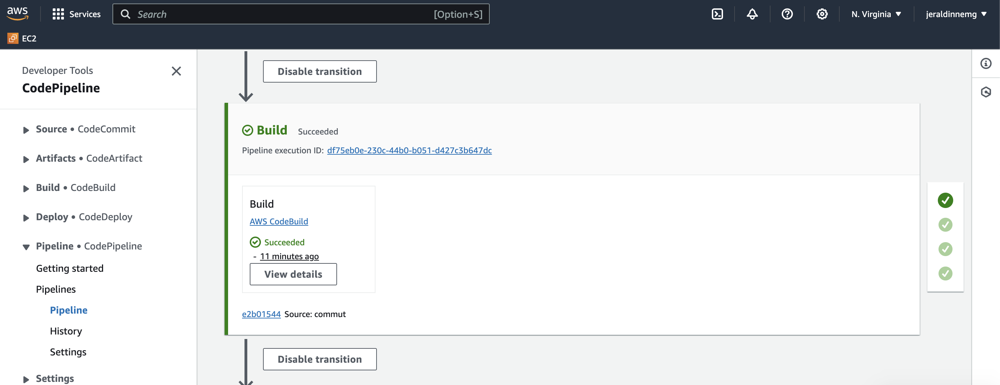
- Pipeline analysis
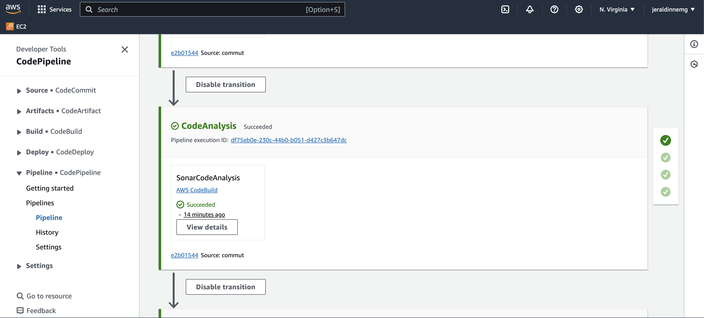
- Pipeline deploy
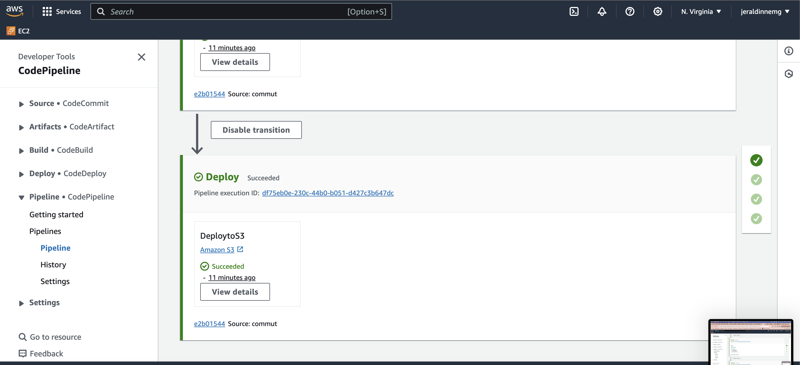
- SNS Confirmation
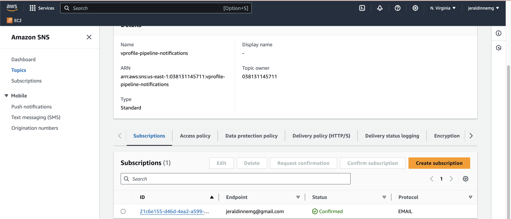
- SNS Confirmation
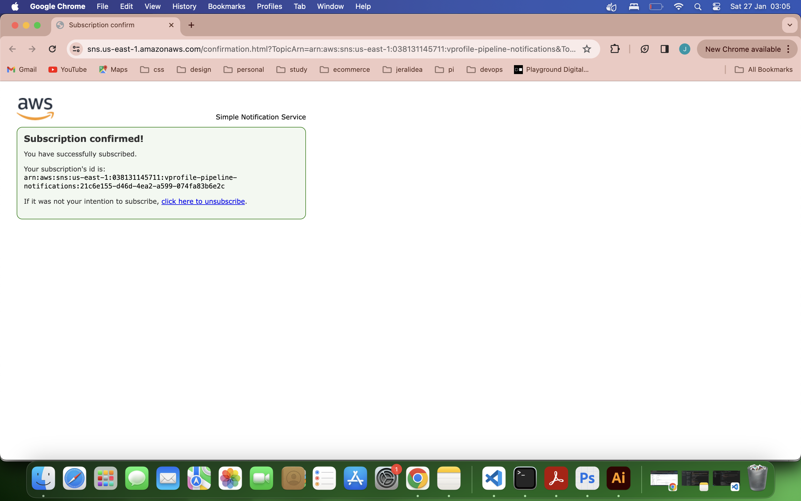
- Sonar
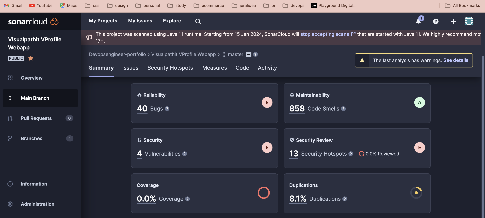
- Quality Gate

- SonarCloud
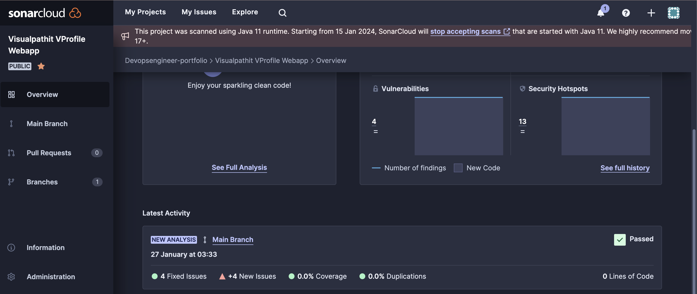
- S3 Bucket
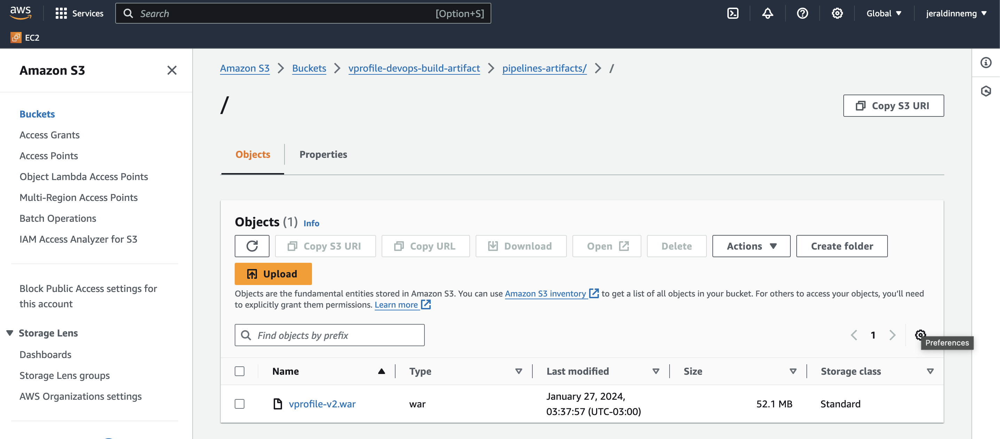
